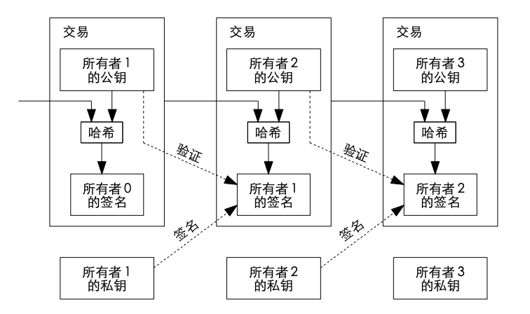

# 🎛️ 双花问题

**Bitcoin 如何解决双花问题**

1. 如何解决矿工双花：共识机制（工作量证明），UTXO模型，最长链原则（区块数量衡量的计算工作量累计最多的链），需要算力达到全球的51%（51%哈希率）；新的区块链如果是基于PoW机制，存在这种情况。
2. 如何解决用户双花：时间戳服务器，服务器会对一个区块的哈希值进行提取得到时间信息，同时服务器会再次加密，打上时间烙印（生成时间戳），最后返回到系统中。

<mark style="background-color:yellow;">原文：在这篇论文中，我们 提出一种使用点对点分布式时间戳服务器为基于时间的交易序列生成计算上的证据来解决 双重支付问题的方案。</mark>

一枚**比特币**就是一条**数字签名链**

**货币末尾存着以下几样东西的数字签名**：

1. 下一个拥有者的公钥的哈希值
2. 上一次交易信息

<figure><figcaption></figcaption></figure>

而一个区块包含以下信息

1. 上一个哈希
2. 随机数
3. 多笔交易
